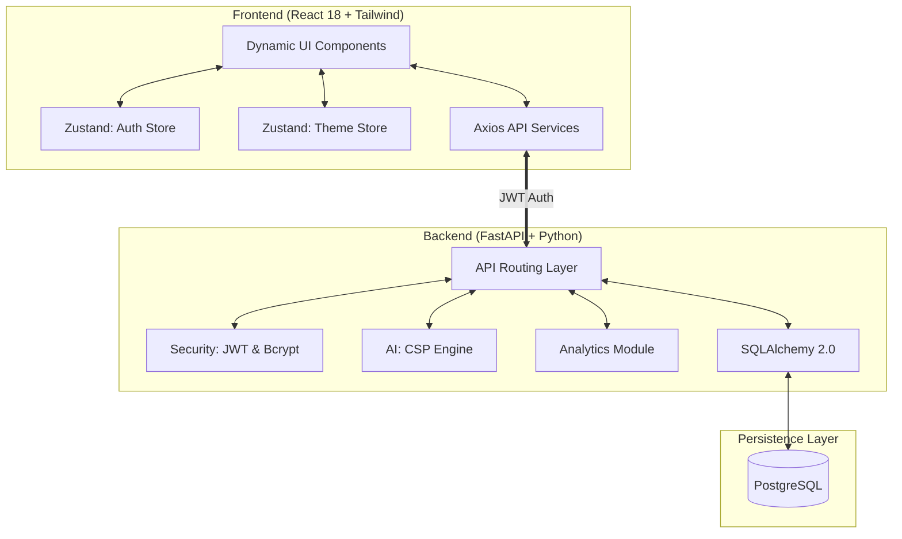

# 🎓 GHRCE AI Master Timetable & College Management System
## Exhaustive Project Documentation (v3.1.0)

This document provides a 0-to-end technical breakdown of the GHRCE AI Timetable system, detailing the architecture, security, core algorithms, and administrative workflows.

---

## 1. System Architecture 🏗️

The system employs a high-performance decoupled architecture designed for scalability and real-time interaction.

---

## 2. Security & Access Control 🔐

The system implements a robust **Role-Based Access Control (RBAC)** model.

-   **Authentication**: Stateless authentication using **JWT (JSON Web Tokens)**. Tokens are verified on every request using custom FastAPI dependencies.
-   **Password Security**: Industry-standard **Bcrypt** hashing via `passlib`.
-   **Authorization Tiers**:
    -   `require_admin`: Grants full access to resource management, AI generation, and analytics.
    -   `require_teacher`: Allows access to personal schedules, workload analytics, and leave applications.
    -   `get_current_user`: Basic access for authenticated users (e.g., viewing public schedules).

---

## 3. The AI Engine: Logic & Constraints 🤖

The core of the system is a **Constraint Satisfaction Problem (CSP)** engine with **Backtracking** optimization.

### 3.1 Scheduling Flow
1.  **Ingestion**: Gathers Teachers, Rooms, Subjects, and TimeSlots.
2.  **Locking**: Identifies existing entries to build a "locked" state of the world.
3.  **Backtracking Loop**:
    -   Picks a Class/Batch.
    -   Selects a Subject based on weekly load.
    -   Finds a qualified Teacher (respecting the **Ownership Lock**).
    -   Allocates Room and Slot.
4.  **Collision Detection**: Validates against 6 primary constraints:
    -   **Teacher Collision**: Is the teacher already in another class?
    -   **Room Occupancy**: Is the room taken?
    -   **Class Overlap**: Are students already in a lecture?
    -   **Subject-per-Day**: Prevents the same subject appearing multiple times in one day.
    -   **Recess Guard**: Skips the mid-day break slot.
    -   **Weekly Load**: Ensures faculty hours do not exceed their `max_load`.

### 3.2 Dynamic Rescheduling
When a teacher marks themselves **"Absent"**, the system triggers a **Conflict Resolution Loop**:
-   Identifies all affected slots.
-   Searches for available substitutes in the same department.
-   Prioritizes teachers qualified for the specific subject.
-   Logs the swap in a `SubstituteAssignment` table for auditing.

---

## 4. Advanced Administrative Features 🛠️

### 📊 Comprehensive Analytics
The `analytics` router provides real-time insights visualized on the dashboard:
-   **Teacher Workload**: Active lecture counts vs. maximum capacity.
-   **Room Utilization**: Percentage of slots used per classroom/lab.
-   **Attendance Trends**: Faculty and student presence patterns.
-   **Departmental Load**: Distribution of academic burden across departments.

### ✍️ Manual Timetable Editor
For edge cases, admins can manually override the AI:
-   **Manual Creation**: Drag-and-drop or form-based slot allocation.
-   **Conflict Validation**: Real-time checking against teacher/room availability before saving.
-   **Subject Mapping**: Automatic filtering of teachers based on subject qualifications.

### 📥 Bulk Data Ingestion
-   **CSV Uploads**: Batch processing for Teachers, Rooms, and Subjects to minimize manual entry.
-   **Seeding System**: Dedicated `seed.py` for initializing fresh environments with institution-specific data.

---

## 5. Database Schema (Selection) 💾

| Table | High-Level Purpose |
| :--- | :--- |
| `users` | Auth credentials and roles. |
| `teachers` | Faculty details, specializations, and load limits. |
| `timetable_entries` | The master schedule (Class, Teacher, Subject, Room, Slot). |
| `leave_requests` | Teacher leave tracking and admin approval workflow. |
| `attendance` | Daily presence logs for faculty. |
| `substitute_assignments` | Audit trail of AI-generated substitutions. |

---

## 6. Frontend Module Overview 💻

Developed with **React 18**, the frontend is divided into specialized modules:
-   **`AdminPortal`**: Dashboard, AI controls, Resource management, and Analytics.
-   **`TeacherPortal`**: Personal timetable, Attendance marking, and Workload visualization.
-   **State Management**:
    -   `authStore (Zustand)`: Handles JWT persistence and user session.
    -   `themeStore (Zustand)`: Manages Dark/Light mode preferences.

---

*GHRCE AI Timetable System - Empowering Academic Excellence through Automation.*
